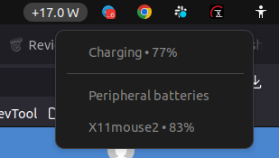

# Charge Power Monitor

[](https://github.com/mackrais-organization/gnom-charge-power-monitor/actions/workflows/ci.yml)
[](https://github.com/mackrais-organization/gnom-charge-power-monitor/actions/workflows/release.yml)
[](LICENSE)
[](https://ko-fi.com/mackrais)

Author: `Oleh Boiko`  
Contact: `developer@mackrais.com`

GNOME Shell extension for Ubuntu/Linux that shows laptop battery power in watts and supported peripheral battery levels in the top panel menu.

It provides:

- a top panel indicator with current laptop battery charge or discharge power in watts
- a dropdown menu with laptop battery state and percentage
- a dropdown section with supported peripheral battery levels when exposed by the system

## Screenshot Example



## Compatibility

Declared `shell-version` support:

- `42`
- `43`
- `44`

## Data Sources

### Laptop battery power

The panel watt indicator reads Linux `power_supply` telemetry from:

- `/sys/class/power_supply/*/power_now`
- `/sys/class/power_supply/*/voltage_now`
- `/sys/class/power_supply/*/current_now`
- `/sys/class/power_supply/*/status`
- `/sys/class/power_supply/*/capacity`

It prefers `power_now` when available and falls back to:

`watts = voltage_now * current_now / 1e12`

### Peripheral battery levels

The dropdown menu tries to detect external device batteries from:

- `UPower` via `upower -d`
- `BlueZ` on the system D-Bus via `org.bluez`

Typical supported devices:

- Bluetooth mice
- Bluetooth keyboards
- some headsets and headphones
- phones or tablets that expose a battery level through the system

## Limitations

- A device is shown only if Linux actually exposes its battery percentage through `UPower` or `BlueZ`.
- Many 2.4G USB receiver devices do not report battery level through standard Linux interfaces.
- Some Bluetooth audio devices appear in `bluetoothctl` but still do not expose `org.bluez.Battery1`, so they will not appear in the extension menu.

## Install

Use the provided installer:

```bash
./install.sh
```

Reinstall and print status, detected UPower devices, and recent GNOME Shell log lines:

```bash
./reinstall.sh
```

Manual install:

```bash
mkdir -p ~/.local/share/gnome-shell/extensions/charge-power-monitor@mackrais.gmail.com
cp -r charge-power-monitor@mackrais.gmail.com/* ~/.local/share/gnome-shell/extensions/charge-power-monitor@mackrais.gmail.com/
gnome-extensions enable charge-power-monitor@mackrais.gmail.com
```

## Reload GNOME Shell

On Xorg in Ubuntu 22.04:

- press `Alt`+`F2`
- type `r`
- press `Enter`

On Wayland, log out and log back in.

## Build Package

To generate the zip for `extensions.gnome.org`:

```bash
./build.sh
```

Before build, the repository runs a local pre-review check:

```bash
./review-check.sh
```

`build.sh` stops on local `error`-level review issues.  
`install.sh` and `reinstall.sh` run the same checks in warning-only mode.

## CI/CD

GitHub Actions workflows are included for a production-style repository setup:

- `CI` runs local review checks, `gjs` syntax validation, `eslint`, and bundle build on push and pull request
- `Release` builds the extension bundle and attaches the zip to a GitHub Release when a `v*` tag is pushed

Local JavaScript tooling:

```bash
npm install
npm run lint
```

## Project Files

- `CONTRIBUTING.md` documents the contribution workflow
- `CHANGELOG.md` tracks notable changes
- `RELEASE.md` contains the release checklist
- `.editorconfig` provides baseline formatting rules
- `.github/dependabot.yml` keeps npm and GitHub Actions dependencies updated

The output archive is:

`dist/charge-power-monitor@mackrais.gmail.com.shell-extension.zip`

The extension package includes:

- `extension.js`
- `metadata.json`
- `icon.svg`
- `icon-symbolic.svg`

PNG exports are also available in the extension directory for website uploads or other project assets.

## Current machine

- OS: Ubuntu 22.04.5 LTS (Jammy Jellyfish)
- GNOME Shell: 42.9
- Desktop session: `ubuntu:GNOME`
